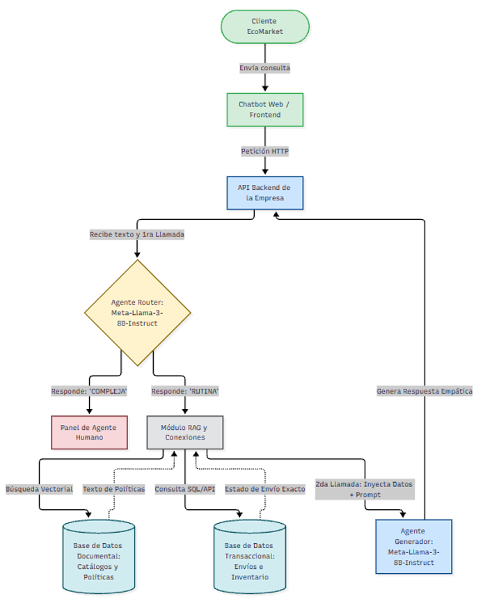

# Optimización de la Atención al Cliente en una Empresa de E-commerce

**Autores:** Anderson Pipicano, Fredy Alvarez  
**Objetivo:** Acelerar y mejorar la calidad de las respuestas en el servicio de atención al cliente.

---

## Fase 1: Selección y Justificación del Modelo de IA

### 1. Selección del Modelo Base (LLM Open-Source)

El primer paso consistió en evaluar distintos modelos de lenguaje de código abierto optimizados para el seguimiento de instrucciones, analizando específicamente Mixtral, qwen3.8-flash-next y Llama-3-8B-Instruct. Tras la revisión técnica, la elección definitiva para el sistema es **Meta-Llama-3-8B-Instruct**. A diferencia de alternativas como qwen3.8-flash-next, el cual es una vista previa experimental y representa un riesgo de estabilidad en entornos de alta demanda, Llama 3 ofrece la madurez, documentación y confiabilidad necesarias para salir a producción.

Esta elección se fundamenta en sus altas capacidades (seguimiento estricto de instrucciones, estructuración de datos, razonamiento lógico y extracción de contexto) y presenta dos ventajas críticas para EcoMarket:

- **Reducción de costos:** Elimina el pago variable por consumo de tokens a proveedores de APIs de terceros (como OpenAI). La empresa puede procesar consultas ilimitadas asumiendo únicamente el costo fijo de la infraestructura.
- **Eficiencia técnica (Sin Fine-Tuning):** Al ser un modelo optimizado para instrucciones, ya cuenta con excelentes capacidades de redacción. Por lo tanto, no se afinará (_fine-tuning_) con datos de la empresa. Afinar un modelo implica internalizar datos estáticos que quedarían obsoletos rápidamente, lo cual es inviable en un e-commerce donde el catálogo y los pedidos cambian minuto a minuto.

### 2. Sistema de Recuperación e Integración de Datos

En lugar de memorizar información mediante entrenamiento, el modelo actuará como un motor de razonamiento puro. Para evitar que alucine respuestas, se implementa una capa de integración que alimenta el prompt con la realidad operativa de la empresa operando en dos niveles:

- **Conexión a Bases de Datos (Datos Estructurados):** El sistema se conecta en tiempo real a la base de datos transaccional o logística (vía API o herramientas de ejecución exacta) para extraer el estado exacto de un envío o cruzar datos de inventario justo en el momento en que el cliente hace la consulta.
- **Repositorios Documentales (RAG Vectorial - Datos no estructurados):** Se utiliza la arquitectura RAG tradicional (búsqueda por similitud semántica) para consultar documentos corporativos, extrayendo información actualizada sobre catálogos de productos, fichas técnicas, listas de precios y políticas de devolución.

### 3. Despliegue e Interacción

El modelo _open-source_ se empaqueta en contenedores (como Docker) y se despliega en instancias de cómputo en la nube con GPUs dedicadas (utilizando entornos como GCP, AWS o Azure). A través de un motor de inferencia (como vLLM u Ollama), el modelo expone una API REST interna. Esto permite que el frontend del chat de EcoMarket se comunique de forma directa con el modelo mediante peticiones estandarizadas, garantizando escalabilidad y manteniendo la privacidad absoluta de los datos corporativos de los clientes.

> _Imagen 1. Diagrama general de la arquitectura propuesta._ 

---

## Fase 2: Evaluación de Fortalezas, Limitaciones y Riesgos Éticos

### 1. Fortalezas

- **Eficiencia y Disponibilidad:** El modelo garantiza una reducción drástica del tiempo de respuesta (pasando del promedio actual de 24 horas a respuestas en milisegundos) y opera con disponibilidad 24/7 para el usuario.
- **Optimización de Costos Operativos:** Al tener la capacidad de procesar un volumen masivo de consultas de forma continua e ininterrumpida, la empresa reduce los costos por interacción. Esto permite sostener el rápido crecimiento de EcoMarket sin incurrir en el pago de horas extras o la contratación de personal para cubrir turnos nocturnos.
- **Escalabilidad Operativa:** Al delegar el 80% de las consultas repetitivas (como estados de pedidos y devoluciones) a la arquitectura de orquestación, el sistema puede absorber grandes picos de demanda durante temporadas altas manteniendo la calidad del servicio.
- **Mejora en la Satisfacción del Cliente:** Al eliminar el cuello de botella actual y proporcionar respuestas de forma oportuna y precisa, se revierte el impacto negativo de las largas esperas, incrementando significativamente la percepción de calidad del servicio y la fidelización hacia la marca.
- **Reducción de Carga Laboral y Revalorización del Capital Humano:** Al automatizar el 80% de las consultas repetitivas, el sistema puede reducir carga operativa relacionada con este proceso. Este capital humano ahora puede ser aprovechado estratégicamente para enfocarse en el 20% restante u otro proceso que la empresa lo requiera: atención de reclamos, gestión de casos especiales, resolución de problemas técnicos, contención de clientes insatisfechos y todas aquellas situaciones críticas que requieren empatía genuina.

### 2. Limitaciones

- **Manejo de empatía y complejidad:** La IA no puede sustituir completamente el criterio y la empatía humana en casos complejos o sensibles.
- **Dependencia de los datos:** La calidad de las respuestas depende de que los datos de EcoMarket sean completos, precisos y actualizados.
- **Posibles respuestas incorrectas:** El modelo puede generar respuestas equivocadas debido a datos deficientes o a errores en el procesamiento del algoritmo.
- **Dependencia tecnológica:** El funcionamiento del sistema depende de servidores, redes, capacidad de cómputo y proveedores tecnológicos, por lo que una falla puede afectar el servicio.

### 3. Riesgos Éticos

- **Alucinaciones y Errores:** El sistema puede generar respuestas impredecibles e inventar información al detectar patrones inexistentes, incluso cuando los datos iniciales son precisos.
- **Sesgo Algorítmico:** La inteligencia artificial hereda prejuicios humanos provenientes de los datos de entrenamiento, los valores de los desarrolladores o su propio aprendizaje. Esto podría desencadenar discriminación injustificada contra ciertos grupos de clientes.
- **Privacidad de Datos:** La necesidad de recopilar grandes volúmenes de datos vulnera la privacidad y expone la información sensible a fugas o uso malicioso. Además, la gestión y anonimización de estos datos crea nuevos dilemas al momento de compartirlos.
- **Impacto Laboral:** Aunque la automatización busca liberar al personal operativo para que pueda atender casos más complejos, existe el riesgo de que la alta eficiencia del sistema se utilice como justificación para reducir puestos de trabajo y aumentar el desempleo. Además, esta transición tecnológica puede afectar principalmente al personal que no cuenta con la formación o las habilidades necesarias para asumir nuevos roles especializados, aumentando las diferencias laborales entre quienes pueden adaptarse a estos cambios y quienes no.

---

### Tabla 1. Riesgos y medidas de mitigación

| Riesgo                                                          | Tipo                    | Nivel de riesgo | Medidas de mitigación                                                                                                                                                              |
| :-------------------------------------------------------------- | :---------------------- | :-------------- | :--------------------------------------------------------------------------------------------------------------------------------------------------------------------------------- |
| **Dificultad para manejar casos complejos o sensibles**         | Limitación / Ético      | Alto            | Para esto se implementa el sistema de clasificación de casos rutinarios y complejos, con lo que se espera mitigar este riego.                                                      |
| **Dependencia de la calidad de los datos**                      | Operativo               | Alto            | Implementar controles de calidad, actualización, validación y limpieza de los datos antes de utilizarlos.                                                                          |
| **Respuestas incorrectas**                                      | Operativo / Técnico     | Alto            | Validar las respuestas, establecer límites al sistema y permitir la revisión humana cuando exista incertidumbre.                                                                   |
| **Dependencia de servidores, redes y proveedores tecnológicos** | Tecnológico             | Alto            | Contar con monitoreo, copias de respaldo, planes de contingencia y mecanismos de recuperación ante fallas.                                                                         |
| **Alucinaciones e información inventada**                       | Ético / Técnico         | Alto            | Utilizar fuentes confiables, limitar las respuestas a información disponible y establecer mecanismos de verificación y supervisión humana. Implantar RAG, e ingeniería de prompts. |
| **Sesgo algorítmico y discriminación**                          | Ético                   | Alto            | Evaluar periódicamente el comportamiento del modelo, revisar los datos de entrenamiento y realizar pruebas sobre diferentes grupos de clientes.                                    |
| **Pérdida o uso indebido de datos personales**                  | Ético / Seguridad       | Crítico         | Aplicar controles de acceso, cifrado, anonimización, gestión de permisos y políticas claras para el tratamiento de datos.                                                          |
| **Reducción de puestos de trabajo por automatización**          | Ético / Social          | Alto            | Priorizar la automatización de tareas repetitivas, capacitar al personal y facilitar la transición hacia nuevas funciones.                                                         |
| **Brecha de habilidades del personal**                          | Social / Organizacional | Alto            | Implementar programas de capacitación y actualización para que los trabajadores puedan asumir nuevas funciones relacionadas con la tecnología.                                     |
