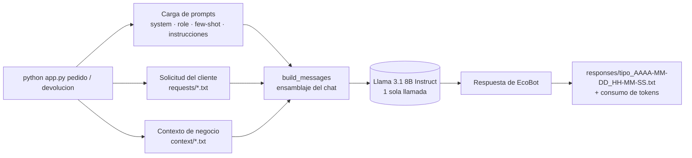

# EcoMarket · EcoBot — Atención al cliente con IA generativa

> Taller Práctico #1 · Inteligencia Artificial Generativa · Semestre III

**Autores:** Anderson Pipicano · Fredy Alvarez

EcoBot es un asistente de atención al cliente para **EcoMarket**, un e-commerce de productos sostenibles. Usa un LLM open-source (**Meta Llama 3.1 8B Instruct**) guiado con **ingeniería de prompts** y **contexto inyectado**. Así responde consultas sobre el **estado de pedidos** y **devoluciones** sin inventar información.

---

## Tabla de contenido

1. [Problema y objetivo](#1-problema-y-objetivo)
2. [Estructura del repositorio](#2-estructura-del-repositorio)
3. [Fase 1 — Selección del modelo y arquitectura](#3-fase-1--selección-del-modelo-y-arquitectura)
4. [Fase 2 — Fortalezas, limitaciones y riesgos éticos](#4-fase-2--fortalezas-limitaciones-y-riesgos-éticos)
5. [Fase 3 — Implementación del prototipo](#5-fase-3--implementación-del-prototipo)
6. [Estrategia de ingeniería de prompts](#6-estrategia-de-ingeniería-de-prompts)
7. [Instalación y ejecución](#7-instalación-y-ejecución)
8. [Casos de prueba](#8-casos-de-prueba)
9. [Limitaciones del prototipo y trabajo futuro](#9-limitaciones-del-prototipo-y-trabajo-futuro)

---

## 1. Problema y objetivo

Hoy EcoMarket tarda en promedio **24 horas** en responder a un cliente. Cerca del **80 %** de las consultas son repetitivas, como _"¿dónde está mi pedido?"_ o _"¿puedo devolver este producto?"_.

**Objetivo:** automatizar ese 80 % con respuestas **inmediatas, precisas y empáticas**. El 20 % restante (reclamos, casos sensibles, productos defectuosos) se escala a agentes humanos.

---

## 2. Estructura del repositorio

```text
Taller-EcoMarket/
├── Fase 1 y Fase 2/
│   ├── caso_de_estudio_markdown.md   # Selección del modelo, arquitectura, fortalezas, riesgos y mitigación
│   └── image.png                     # Diagrama de la arquitectura propuesta
│
└── Fase 3/                           # Prototipo funcional de EcoBot
    ├── app.py                        # Orquestador: arma los prompts, llama al LLM y guarda la respuesta
    ├── requirements.txt
    ├── .env.example                  # Plantilla de configuración (token, modelo, hiperparámetros)
    ├── README.md                     # Guía rápida de la Fase 3
    ├── Estructura y función de los archivos utilizados por EcoBot en EcoMarket.md
    ├── prompts/                      # Ingeniería de prompts (versión vigente)
    │   ├── system.txt                # Reglas globales y restricciones anti-alucinación
    │   ├── role_prompt.txt           # Persona "EcoBot", tono y comportamiento
    │   ├── instruction_prompt.txt    # Procedimiento de análisis previo a responder
    │   ├── pedido.txt                # Reglas para consultas de pedidos
    │   ├── devolucion.txt            # Reglas para devoluciones
    │   ├── positive_example.txt      # Few-shot: casos bien planteados
    │   ├── positive_output.txt       # Few-shot: respuestas ideales
    │   ├── negative_example.txt      # Ejemplos contrastivos: casos problemáticos
    │   ├── negative_output.txt       # Respuestas incorrectas (que se deben evitar)
    │   └── negative_reasoning.txt    # Por qué cada respuesta negativa es incorrecta
    ├── prompts copy/                 # Versión anterior de los prompts (referencia de iteración)
    ├── context/                      # Fuentes de conocimiento (simulan BD y documentos)
    │   ├── pedidos.txt               # 10 pedidos de prueba (ECO-10001 … ECO-10010)
    │   └── politica_devoluciones.txt # Política oficial de devoluciones
    ├── requests/                     # Mensajes de clientes de prueba
    │   ├── pedido.txt / pedido-example*.txt
    │   └── devolucion.txt / devolucion-example*.txt
    └── responses/                    # Salidas generadas (con fecha/hora y consumo de tokens)
```

---

## 3. Fase 1 — Selección del modelo y arquitectura

| Decisión                    | Elección                                               | Justificación                                                                                                                                        |
| :-------------------------- | :----------------------------------------------------- | :--------------------------------------------------------------------------------------------------------------------------------------------------- |
| **Modelo base**             | Meta Llama 3 8B Instruct (open-source)                 | Maduro, bien documentado y afinado para seguir instrucciones. Se descartaron Mixtral y una alternativa de Qwen experimental por costo y estabilidad. |
| **Fine-tuning**             | **No** se aplica                                       | El catálogo y los pedidos cambian minuto a minuto. Afinar el modelo con esos datos los dejaría obsoletos enseguida.                                  |
| **Conocimiento**            | Recuperación en tiempo de consulta                     | **Datos estructurados** (pedidos, inventario) vía API/BD y **documentos** (políticas, catálogo) vía **RAG vectorial**.                               |
| **Despliegue (producción)** | Contenedor Docker + vLLM/Ollama en GPU (GCP/AWS/Azure) | Costo fijo en lugar de pago por token. Los datos de los clientes no salen de la infraestructura propia.                                              |

El modelo funciona como **motor de razonamiento**. El conocimiento del negocio no se guarda en sus pesos: se le entrega en el prompt en cada consulta.


📄 Detalle completo: [`Fase 1 y Fase 2/caso_de_estudio_markdown.md`](Fase%201%20y%20Fase%202/caso_de_estudio_markdown.md)

---

## 4. Fase 2 — Fortalezas, limitaciones y riesgos éticos

| Fortalezas                                | Limitaciones                        | Riesgos éticos                          |
| :---------------------------------------- | :---------------------------------- | :-------------------------------------- |
| Respuestas en segundos (no en 24 h), 24/7 | Empatía limitada en casos complejos | Alucinaciones                           |
| Menor costo por interacción               | Depende de la calidad de los datos  | Sesgo algorítmico                       |
| Absorbe picos de demanda                  | Posibles respuestas incorrectas     | Privacidad de datos personales          |
| Libera personal para casos críticos       | Depende de la infraestructura       | Impacto laboral y brecha de habilidades |

**Mitigaciones clave:**

- Clasificar los casos en rutinarios o complejos y escalar estos últimos a un humano.
- Usar RAG y restringir las respuestas al contexto.
- Supervisión humana cuando haya incertidumbre.
- Cifrado y anonimización de datos personales.
- Capacitación del personal.

La matriz completa de riesgos está en la _Tabla 1_ del caso de estudio.

📄 Detalle completo: [`Fase 1 y Fase 2/caso_de_estudio_markdown.md`](Fase%201%20y%20Fase%202/caso_de_estudio_markdown.md)

---

## 5. Fase 3 — Implementación del prototipo

El prototipo usa **Llama 3.1 8B Instruct** a través de **Hugging Face Inference Providers** (`huggingface_hub.InferenceClient`). En producción el modelo se autoalojaría con vLLM u Ollama (ver Fase 1).

### Flujo de una ejecución



### Contexto que recibe cada tipo de solicitud

| Tipo         | Prompt específico        | Contexto inyectado                                          | Solicitud                 |
| :----------- | :----------------------- | :---------------------------------------------------------- | :------------------------ |
| `pedido`     | `prompts/pedido.txt`     | `context/pedidos.txt`                                       | `requests/pedido.txt`     |
| `devolucion` | `prompts/devolucion.txt` | `context/pedidos.txt` + `context/politica_devoluciones.txt` | `requests/devolucion.txt` |

Cada archivo de contexto va etiquetado con su fuente (`FUENTE: pedidos.txt`) para que el modelo distinga los datos de pedidos de la normativa.

---

## 6. Estrategia de ingeniería de prompts

`build_messages()` en [`app.py`](Fase%203/app.py) arma la conversación en capas:

|  #  | Rol                  | Contenido                                                                   | Técnica                                                                                                                                                                          |
| :-: | :------------------- | :-------------------------------------------------------------------------- | :------------------------------------------------------------------------------------------------------------------------------------------------------------------------------- |
|  1  | `system`             | `system.txt`                                                                | **Reglas globales / guardrails.** Solo usa el contexto, nunca inventa fechas, estados ni políticas, pide revisión humana si hay ambigüedad y no muestra su razonamiento interno. |
|  2  | `system`             | `role_prompt.txt`                                                           | **Role prompting.** Persona _EcoBot_ con un tono cercano, empático y resolutivo, que no suena a base de datos.                                                                   |
|  3  | `user`               | Ejemplo negativo + salida incorrecta + explicación                          | **Ejemplos contrastivos (negative prompting).** Muestran errores típicos y por qué lo son.                                                                                       |
|  4  | `user` → `assistant` | `positive_example.txt` → `positive_output.txt`                              | **Few-shot prompting.** Demuestra la respuesta ideal como turno del asistente.                                                                                                   |
|  5  | `user`               | Solicitud + reglas del tipo + contexto, entre delimitadores `>>>>> … <<<<<` | **Grounding / RAG en contexto** con **delimitadores** que separan instrucciones de datos.                                                                                        |
|  6  | `user`               | `instruction_prompt.txt`                                                    | **Instrucción final** (_recency_): el procedimiento de análisis queda al final, justo antes de generar.                                                                          |

[`Ver promts`](Fase%203/prompts)
[`Ver contexto`](Fase%203/context)

**Decisiones de diseño relevantes:**

- **El ejemplo negativo nunca va con rol `assistant`.** Si fuera así, el modelo lo tomaría como una conducta propia y podría imitarlo. Por eso se presenta como contenido de usuario y con su explicación.
- **Identificación estricta del pedido.** `ECO-10004` y `10004` son equivalentes, pero no se aceptan coincidencias parciales ni aproximadas. Sin código, el modelo **no** elige un pedido: lo solicita.
- **Razonamiento interno, respuesta limpia.** El modelo analiza en silencio. El cliente solo ve la conclusión y su justificación (evidencia), en uno o dos párrafos.
- **Hiperparámetros conservadores:** `temperature = 0.2` para respuestas deterministas y fieles al contexto, y `max_tokens = 1024`.
- **Prompts como archivos `.txt`.** Se pueden iterar y versionar sin tocar el código. La carpeta `prompts copy/` guarda la versión anterior para comparar.

---

## 7. Instalación y ejecución

**Requisitos:** Python 3.10+ y un token de Hugging Face con permiso de _Inference_. Para acceder a Llama puede ser necesario aceptar la licencia de Meta en Hugging Face.

```powershell
cd "Fase 3"

python -m venv .venv
.\.venv\Scripts\Activate.ps1        # Linux/macOS: source .venv/bin/activate

pip install -r requirements.txt

Copy-Item .env.example .env         # Linux/macOS: cp .env.example .env
# Edita .env y coloca tu token real en HF_TOKEN
```

### Variables de entorno (`.env`)

| Variable      | Valor por defecto                  | Descripción                             |
| :------------ | :--------------------------------- | :-------------------------------------- |
| `HF_TOKEN`    | — (obligatoria)                    | Token de Hugging Face                   |
| `HF_MODEL`    | `meta-llama/Llama-3.1-8B-Instruct` | Modelo a utilizar                       |
| `HF_PROVIDER` | `auto`                             | Proveedor de inferencia de Hugging Face |
| `MAX_TOKENS`  | `1024`                             | Longitud máxima de la respuesta         |
| `TEMPERATURE` | `0.2`                              | Aleatoriedad de la generación           |

### Uso

```bash
python app.py pedido        # Consulta de estado de pedido
python app.py devolucion    # Solicitud de devolución
```

Cada ejecución hace **exactamente una llamada** al modelo. Muestra la respuesta y el consumo de tokens en consola, y la guarda en `responses/`, por ejemplo:

```text
responses/pedido_2026-09-22_21-30-15.txt
responses/devolucion_2026-09-22_21-32-08.txt
```

Para probar otro caso, reemplaza el contenido de `requests/pedido.txt` o `requests/devolucion.txt`. Los archivos `*-example*.txt` son escenarios alternativos que puedes copiar allí.

---

## 8. Casos de prueba

| Escenario                        | Entrada                            | Comportamiento esperado                                                     |
| :------------------------------- | :--------------------------------- | :-------------------------------------------------------------------------- |
| Pedido con código                | "¿Dónde está mi pedido ECO-10004?" | Informa el estado, la fecha estimada y la transportadora de **ese** pedido. |
| Pedido con solo el número        | "…el encargo 10009…"               | Reconoce `10009` como `ECO-10009`.                                          |
| Pedido sin código                | "Mi pedido no ha llegado"          | Pide el número de pedido. **No** elige ningún pedido.                       |
| Código inexistente               | "¿Qué pasó con ECO-99999?"         | Pide verificar el código. **No** lo sustituye por uno parecido.             |
| Devolución sin datos suficientes | "Quiero devolver ECO-10006"        | Pide solo el dato que falta (uso y empaque).                                |
| Devolución no procedente         | Producto de higiene ya abierto     | Rechaza la devolución y cita el motivo de la política.                      |
| Producto defectuoso o dañado     | —                                  | Escala el caso a un agente humano.                                          |

---

## 9. Limitaciones del prototipo y trabajo futuro

- **Contexto completo en el prompt.** Con 10 pedidos es viable. A escala real hay que **recuperar solo el pedido consultado** (consulta a BD o _function calling_) y usar **RAG vectorial** para las políticas y el catálogo.
- **Una sola interacción.** Todavía no hay memoria conversacional multi-turno ni interfaz de chat.
- **Clasificación de intención manual.** Hoy el tipo (`pedido`/`devolucion`) se pasa por argumento. El siguiente paso es un **router** automático de intención y de escalamiento a humanos.
- **Evaluación.** Falta un conjunto de pruebas automatizado: _golden set_, métricas de fidelidad al contexto y tasa de alucinación, y _LLM-as-a-judge_.
- **Guardrails de salida.** Validar la respuesta antes de enviarla (fechas y códigos presentes en el contexto) y filtrar datos personales.
- **Despliegue propio.** Migrar de Hugging Face Inference a vLLM u Ollama en contenedores, como propone la Fase 1.

---

<sub>Proyecto académico. Los pedidos, enlaces de seguimiento y políticas son datos ficticios de prueba.</sub>
